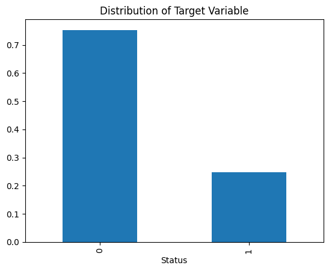
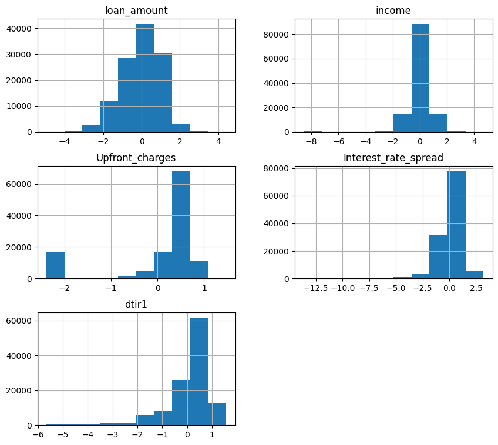
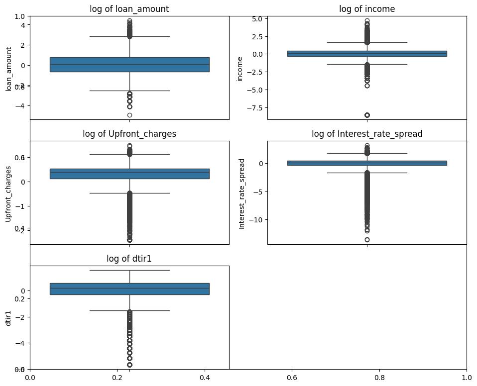
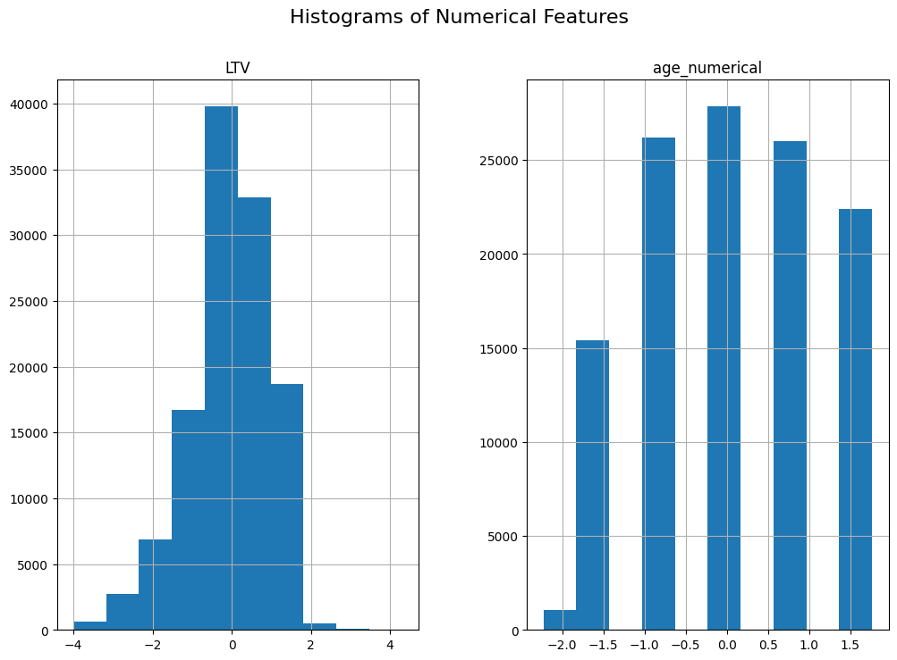
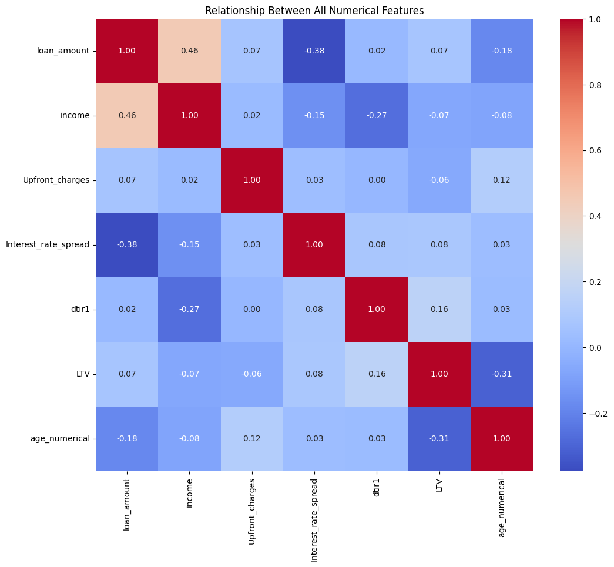
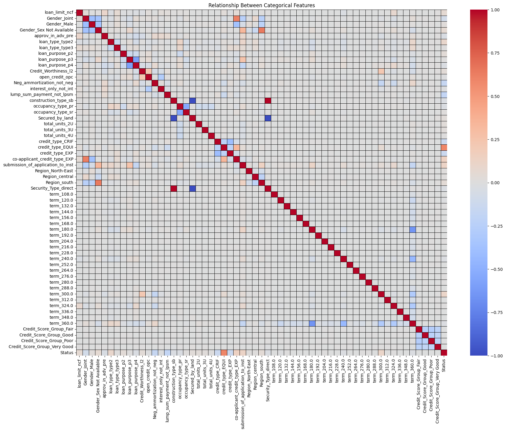
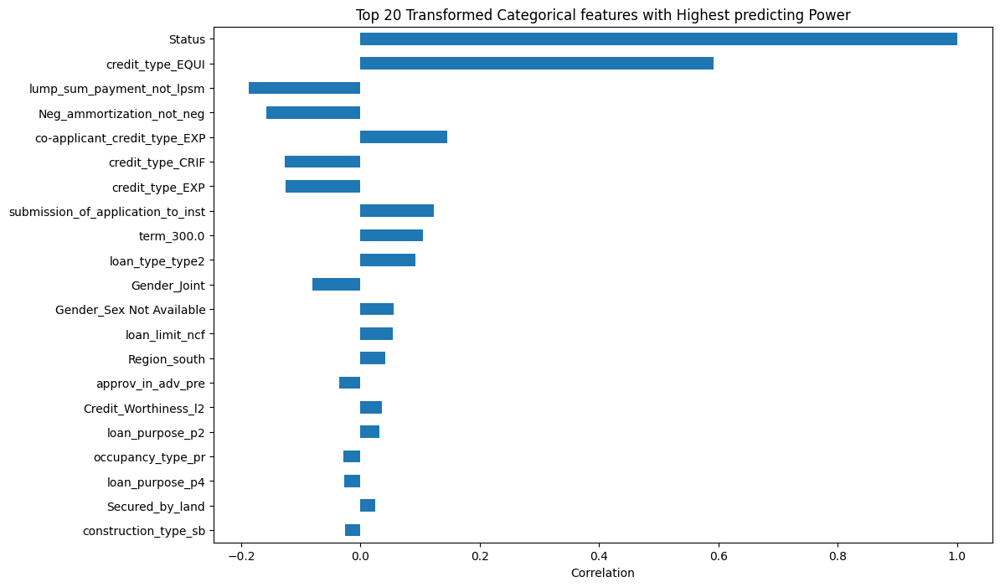
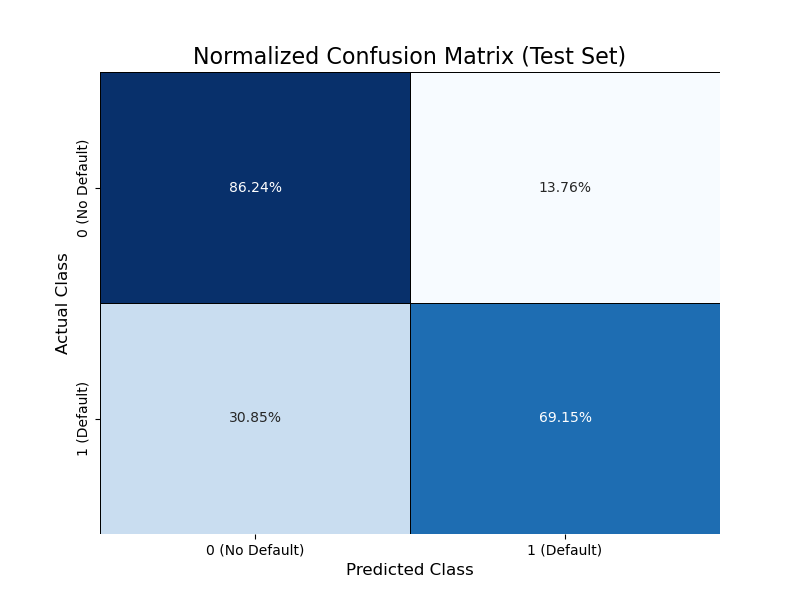
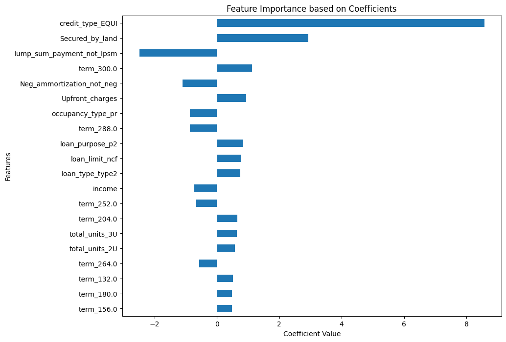

# **Loan Default Prediction**

This project aims to build a robust and interpretable machine learning model to predict loan default (Status=1) using a dataset containing various applicant and loan characteristics. The core challenge is handling the imbalanced nature of the target variable and ensuring the model performs reliably on the high-risk (default) class.


## **Project Goal**

To deploy a highly interpretable **Classification ML model** model optimized for **Area Under the Curve (AUC)** to maximize the separation between defaulting and non-defaulting loans.

## **Dataset and Target Variable**

The dataset consists of loan application and status records. Sourced from [kaggle](https://www.kaggle.com/datasets/yasserh/loan-default-dataset?resource=download)

* **Target Variable:** Status  
  * 0: Loan Repaid (No Default)  
  * 1: Loan Defaulted (High Risk)  
* **Imbalance:** The target variable is imbalanced, where the majority class is `1` while minority class is `0`



---

## **🛠 Methodology**

### **Repository Structure**

```
.
├── data/
│   └── loan_Default.csv (raw dataset)
├── images/
│   └── various visualizations... (important plots and images)
├── modules/
│   ├── preprocess.py (Initial Preprocessing Script)
│   ├── preprocess_2.py (The final, refined preprocessing pipeline script)
│   └── model.py (Modeling Script)
└── notebook/
    ├── initial_EDA.ipynb
    ├── second_EDA.ipynb
    ├── final_EDA.ipynb
    └── logistic_reg.ipynb (Notebook used for final tuning and analysis)
```

### **1\. Data Preprocessing (modules/preprocess\_2.py)**

A comprehensive scikit-learn pipeline was constructed to ensure consistent and scalable data transformations.

| Transformation | Features Applied To | Description |
| :---- | :---- | :---- |
| **Data Cleaning** | All | Dropping of collinear/redundant features (ID, year, property\_value, rate\_of\_interest, business\_or\_commercial). |
| **Feature Engineering** | age, Credit\_Score | Converted age ranges to numerical midpoints. Binned Credit\_Score into categorical groups (Poor, Fair, Good, etc.). |
| **Log Transformation** | loan\_amount, income, Upfront\_charges, Interest\_rate\_spread, dtir1 | Applied $\\text{log}(1+x)$ to reduce skewness and stabilize variance. |
| **Scaling** | All Numerical | Applied StandardScaler after imputation and log transformation. |
| **Encoding** | All Categorical | Applied OneHotEncoder(drop='first') to convert categories into numerical features for the model. |

### **Result After Final Transformations**

- Distribution of Log transformed Numerical Features became model-ready

| Log_transformed | log_boxplot | Num_Capped |
|-----------------|-------------|------------|
|  |  |  |
  
- Result from multivariant Analysis on all transformed `numerical features`


 
- Result fron multivariant Analysis on transformed `Categorical features`



- highest 20 predicting power features




### **2\. Modeling and Tuning (model.py\_and\_log_reg.ipynb)**

* **Model:** Logistic Regression (solver='liblinear', class\_weight='balanced').  
* **Tuning:** A **Grid Search Cross-Validation** was performed to find the optimal regularization parameter (C) in the range of $0.001$ to $100$.  
* **Scoring Metric:** The model was optimized using **roc\_auc** (Area Under the Curve) to evaluate its discriminatory power.

## **Final Model Performance**

The best-performing model (tuned for optimal C) was evaluated on the unseen test set.

| Metric | Score | Context |
| :---- | :---- | :---- |
| **Final AUC Score** | **0.8630** | The model has an 86.3% chance of correctly distinguishing between a random positive (defaulter) and a random negative (non-defaulter). |
| **Overall Accuracy** | **0.8203** | Overall correct prediction rate. |

### **Classification Report Summary**

| Class | Precision | Recall | Interpretation |
| :---- | :---- | :---- | :---- |
| **0 (No Default)** | 89.52% | 86.24% | High confidence in approving safe loans. |
| **1 (Default)** | **62.17%** | **69.15%** | **69.15%** of all actual defaults were successfully flagged (High Recall for loss prevention). |

### **Normalized Confusion Matrix**



The normalized confusion matrix shows the percentage of correct and incorrect predictions within the actual class.

* **True Default Rate (Recall):** 69.15% (Bottom Right)  
* **False Positive Rate (False Alarm):** 13.76% (Top Right)  
  * The model achieves high default detection by accepting a manageable 13.76% false alarm rate.

## **Feature Interpretability**

Logistic Regression allows direct interpretation of risk drivers through the feature coefficients.

* **Positive Coefficient:** The feature increases the log-odds of the loan defaulting (higher risk).  
* **Negative Coefficient:** The feature decreases the log-odds of the loan defaulting (lower risk).

### **Top 10 Most Influential Features**



The coefficients extracted from the best-tuned model reveal the top risk drivers:

1. **credit\_type\_EQUI (Positive):** This specific credit type is the strongest predictor of increased default risk.  
2. **Neg\_ammortization\_not\_neg (Negative):** Not having a Negative Amortization loan (i.e., having a standard loan) significantly *decreases* default risk, as expected.  
3. **loan\_limit\_cf (Negative):** Having a conforming loan limit *decreases* default risk.  
4. **loan\_type\_type2 (Positive):** This specific loan type category increases default risk.  
5. **Interest\_rate\_spread (Positive):** A wider spread (higher risk differential) increases the likelihood of default.  
6. **LTV (Positive):** A higher Loan-to-Value ratio increases default risk.

## **Next Steps**

- Next step will be to test Ensemble methods like **Random Forest** or **Gradient Boosting** (e.g., XGBoost) to see if better performance can be achieved by capturing non-linear relationships.  
